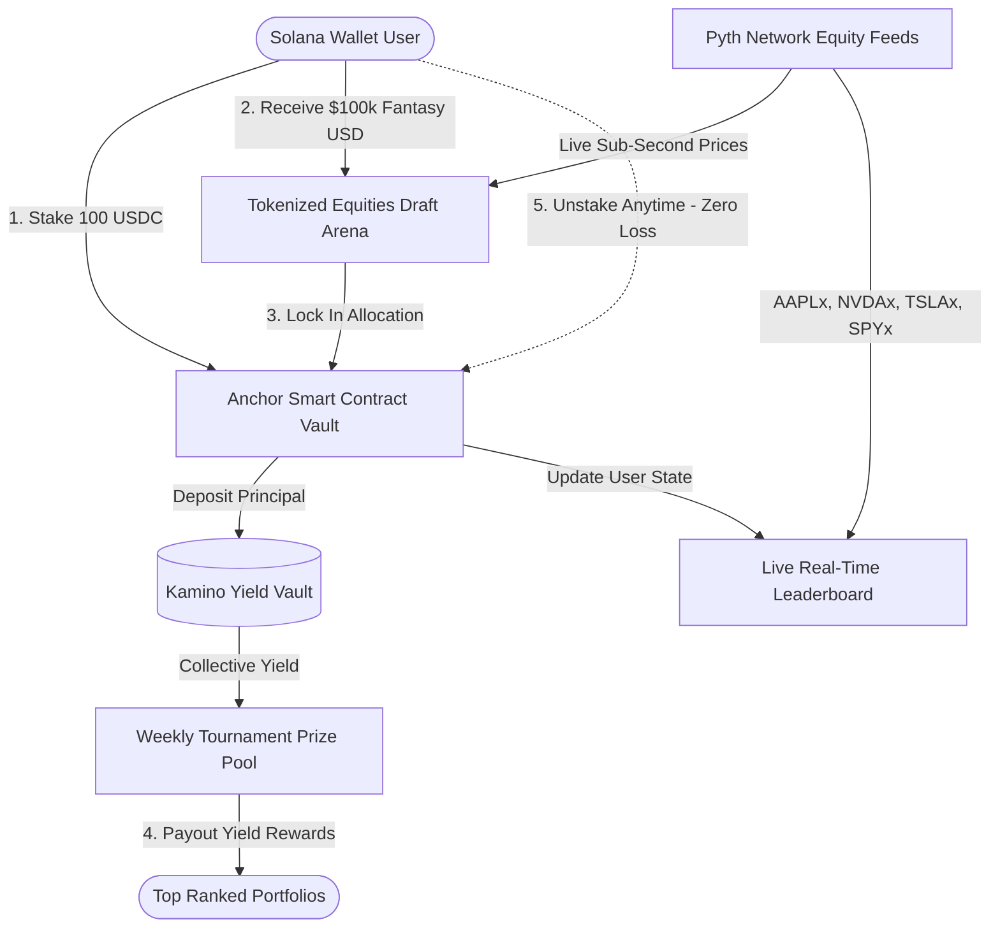

# 📈 Stocklana Fantasy

> **Zero-Loss Fantasy Wall Street on Solana** — Powered by Pyth Network, Kamino DeFi Yield, and Token-2022 xStocks.


---

## ⚡ The Problem: The "Ghost Town" of Tokenized Equities
Tokenized stocks (**xStocks**) are live on Solana with deep pools across Meteora and Raydium. However, **retail adoption is near-zero**. Traditional retail traders find DEX swap mechanics intimidating, capital-inefficient, and fraught with regulatory anxiety. 

To bring 100,000+ retail traders on-chain, Solana doesn't need another generic swap UI. **It needs a gamified, zero-risk Trojan horse.**

---

## 🏆 The Solution: Stocklana Fantasy
**Stocklana Fantasy** borrows the high-engagement mechanics of Fantasy Premier League / Sleeper and merges them with the capital preservation of prize-linked savings (PoolTogether):

1. **Zero-Loss Entry**: Users stake **100 USDC** into the protocol. Funds are deposited into a **Kamino DeFi yield vault**. The user's principal is never risked and can be withdrawn at any time.
2. **$100,000 Fantasy Purchasing Power**: Staking instantly credits the user with **$100k in virtual Fantasy Dollars**.
3. **Draft Real Tokenized Stocks**: Users draft their dream portfolio from Solana's official **Token-2022 tokenized equities** (`AAPLx`, `NVDAx`, `TSLAx`, `SPYx`).
4. **Real-Time Pyth Oracles**: Assets are valued dynamically via live sub-second **Pyth Network** price updates.
5. **Live Tournament Leaderboard**: Competitors battle on a real-time ticking leaderboard. The top traders at the end of the weekly round win the yield generated by the pool (**$1,450.00+ Prize Pool**).

---

## 🏗️ System Architecture



---

## 📦 Supported Tokenized Assets (Token-2022)

| Symbol | Underlying Asset | Category | Standard | Oracle Integration |
| :--- | :--- | :--- | :--- | :--- |
| **`AAPLx`** | Apple Inc. | Mega-Cap Tech | SPL Token-2022 | Pyth Equity Oracle |
| **`NVDAx`** | NVIDIA Corp. | AI & Semi | SPL Token-2022 | Pyth Equity Oracle |
| **`TSLAx`** | Tesla Inc. | EV & Energy | SPL Token-2022 | Pyth Equity Oracle |
| **`SPYx`** | S&P 500 Index ETF | Macro Benchmark | SPL Token-2022 | Pyth Equity Oracle |

---

## ⛓️ On-Chain Smart Contract Details

- **Cluster**: Solana Devnet
- **Framework**: Anchor (Rust)
- **Program ID**: [`9nZZc7LAuvrtSv9dNjMrYwyFsuW7aJKnhydPQRi6ijP1`](https://explorer.solana.com/address/9nZZc7LAuvrtSv9dNjMrYwyFsuW7aJKnhydPQRi6ijP1?cluster=devnet)

### Program Instructions:
1. `initialize_user`: Derives PDA `[b"user_state", user_pubkey]` to initialize player record.
2. `stake`: Transfers 100 USDC collateral from user token account into the vault PDA.
3. `update_portfolio`: Stores up to 5 tokenized equity positions on-chain with validation.
4. `unstake`: Returns 100% of user collateral with zero loss.

---

## 🎥 2.5-Minute Demo Walkthrough Script

| Time | Action | Voiceover / Narrative |
| :--- | :--- | :--- |
| **0:00 - 0:30** | Connect Phantom Wallet | *"Tokenized stocks have millions in liquidity on Solana, but retail traders lack an easy way to play. Welcome to Stocklana Fantasy."* |
| **0:30 - 1:00** | View Prize Pool & Stake 100 USDC | *"We stake 100 USDC. Our deposit is safe in a DeFi yield vault with zero risk of loss. We receive $100,000 in virtual drafting capital."* |
| **1:00 - 1:45** | Draft AAPLx, NVDAx, TSLAx, SPYx | *"Using real-time Pyth price feeds, we allocate our budget across Solana Token-2022 equities and lock in our portfolio."* |
| **1:45 - 2:15** | Live Leaderboard (The Money Shot) | *"Our portfolio enters the active tournament. As Pyth prices tick live, our total valuation updates and our rank climbs in real time against rivals."* |
| **2:15 - 2:30** | Unstake 100 USDC | *"When we want to exit, we click Unstake. 100% of our principal is returned with zero loss. Risk-free Wall Street, natively on Solana."* |

---

## 🚀 Quickstart (Local Development)

### 1. Prerequisites
- Node.js 18+
- Solana CLI & Anchor 0.30+ (for contract builds)
- Phantom or Solflare Wallet

### 2. Run the Web Application
```bash
cd web
npm install
npm run dev
```
Open **[http://localhost:3000](http://localhost:3000)** in your browser.

### 3. Build Anchor Smart Contracts
```bash
cd program
anchor build
anchor test
```

---

## 🛡️ License
MIT License. Built for the Stocklana Solana Hackathon 2026.
