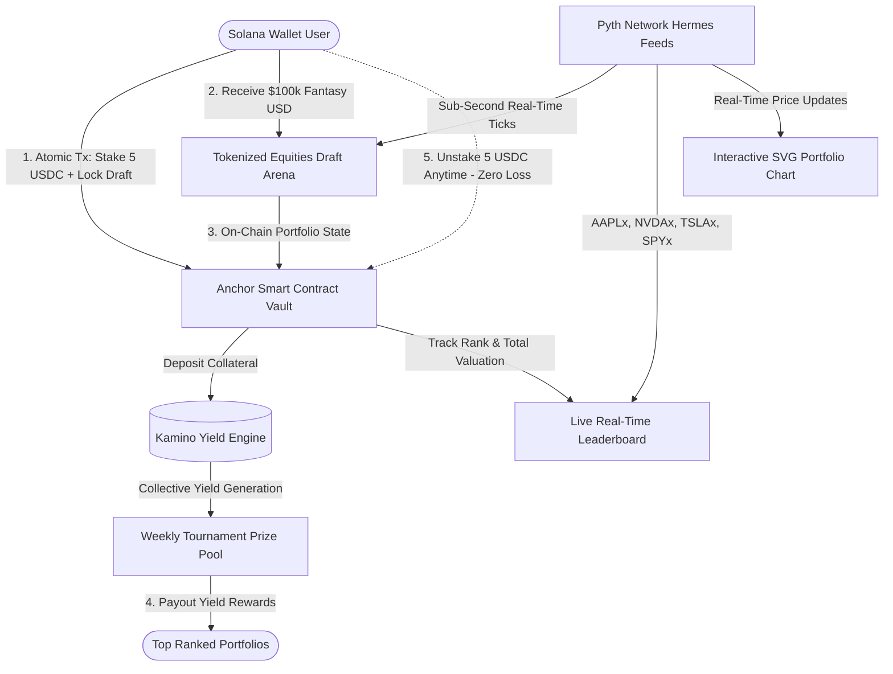

# 📈 Stocklana Fantasy

> **Zero-Loss Fantasy Stock Trading on Solana** — Powered by Pyth Network Real-Time Oracles, Kamino DeFi Yield Engine, and SPL Token-2022 Equities.

[](https://explorer.solana.com/address/hGenhdu1tQPYJCvKF1XnemEV83eo1gQvp7LgcmRcway?cluster=devnet)
[](https://www.anchor-lang.com/)
[](https://pyth.network/)
[](https://opensource.org/licenses/MIT)

---

## ⚡ The Problem: The "Ghost Town" of Tokenized Equities

Tokenized stocks (**xStocks**) have deep liquidity pools on Solana across Meteora and Raydium. However, **retail adoption remains near-zero**. Traditional retail traders find standard DEX swaps intimidating, high-risk, and capital-inefficient. Meanwhile, traditional fantasy sports and retail stock options expose traders to 90%+ loss rates and liquidations.

To bring 100,000+ retail equity traders on-chain, Solana doesn't need another generic swap interface. **It needs a gamified, zero-risk Trojan horse.**

---

## 🏆 The Solution: Stocklana Fantasy

**Stocklana Fantasy** borrows the viral engagement mechanics of fantasy sports leagues (Sleeper, FPL) and merges them with the capital preservation of prize-linked savings (PoolTogether):

1. **Zero-Loss Staking**: Users stake a collateral deposit (**5 USDC**) into the protocol vault. Staked funds earn passive yield in **Kamino DeFi yield pools**. The user's principal is 100% safe and can be unstaked at any time with zero penalty.
2. **$100,000 Fantasy Purchasing Power**: Depositing instantly unlocks **$100,000 in virtual fantasy capital** for the tournament.
3. **Draft Real Tokenized Stocks**: Users draft their basket of equities from Solana's official **Token-2022 tokenized equities** (`AAPLx`, `NVDAx`, `TSLAx`, `SPYx`).
4. **Sub-Second Pyth Oracles**: Portfolios are valued in real time via live, streaming **Pyth Network Hermes price feeds**.
5. **Interactive Live Performance Chart**: Real-time SVG performance curve with dynamic crosshair scrubbing, history inspection, and timeframe toggles (`LIVE`, `1H`, `24H`, `7D`).
6. **Weekly Tournament Yield Payouts**: Competitors battle on a real-time leaderboard. The top traders at the end of the round win the yield generated by the pool (**$1,450.00+ Prize Pool**). You can win real USDC, but you can never lose your staked principal.

---

## 🏗️ System Architecture



---

## 💎 Key Innovations & Technical Highlights

### 1. Atomic 1-Click Staking & Draft Locking
Unlike traditional dApps that force users through 3 to 4 confusing popups, Stocklana bundles:
- Associated Token Account (ATA) creation (idempotent)
- Player `user_state` PDA account initialization
- 5 USDC vault transfer
- On-chain portfolio drafting

into a **single atomic Solana transaction**. This eliminates simulation failures in Phantom, minimizes transaction fees, and provides a web2-grade onboarding experience.

### 2. Live Interactive Performance Chart
An institutional-grade SVG area chart built directly into the player's cockpit:
- **Streaming Pyth Ticks:** Appends new data points live as Pyth feeds update.
- **Interactive Crosshair Scrubbing:** Moving cursor across the curve updates valuation and timestamp in real time.
- **Timeframe Switching:** Quick toggles for `LIVE`, `1H`, `24H`, and `7D`.
- **Zero Bloat:** Pure hardware-accelerated SVG splines without heavy charting libraries.

### 3. Bespoke Brand Identity
- Custom vector brandmark fusing **Solana's kinetic speed chevrons** with an **ascending market candlestick / 'S' silhouette**.
- Clean Swiss dark-mode editorial aesthetic (matte obsidian blacks `#0a0a0a`, `#111114` with crisp 1px borders).

---

## 📦 Supported Tokenized Assets (Token-2022)

| Symbol | Underlying Asset | Category | Standard | Oracle Feed |
| :--- | :--- | :--- | :--- | :--- |
| **`AAPLx`** | Apple Inc. | Mega-Cap Tech | SPL Token-2022 | Pyth Hermes Equity Oracle |
| **`NVDAx`** | NVIDIA Corp. | AI & Hardware | SPL Token-2022 | Pyth Hermes Equity Oracle |
| **`TSLAx`** | Tesla Inc. | EV & Clean Energy | SPL Token-2022 | Pyth Hermes Equity Oracle |
| **`SPYx`** | S&P 500 Index ETF | Macro Benchmark | SPL Token-2022 | Pyth Hermes Equity Oracle |

---

## ⛓️ Deployed Smart Contract & On-Chain Addresses

The smart contract is live and fully verified on **Solana Devnet**:

| Account / Contract | Address / Explorer Link |
| :--- | :--- |
| **Anchor Program ID** | [`hGenhdu1tQPYJCvKF1XnemEV83eo1gQvp7LgcmRcway`](https://explorer.solana.com/address/hGenhdu1tQPYJCvKF1XnemEV83eo1gQvp7LgcmRcway?cluster=devnet) |
| **USDC Mint (Circle Devnet)** | [`4zMMC9srt5Ri5X14GAgXhaHii3GnPAEERYPJgZJDncDU`](https://explorer.solana.com/address/4zMMC9srt5Ri5X14GAgXhaHii3GnPAEERYPJgZJDncDU?cluster=devnet) |
| **Protocol Vault Token PDA** | [`38dPemtnG74ruDjMUduHQprjFdkAXA9xxU16j86FJF2k`](https://explorer.solana.com/address/38dPemtnG74ruDjMUduHQprjFdkAXA9xxU16j86FJF2k?cluster=devnet) |

### Program Instructions (Rust / Anchor):
1. `initialize_vault`: Creates the protocol's PDA-governed USDC token vault.
2. `initialize_user`: Derives PDA `[b"user_state", user_pubkey]` to initialize player account.
3. `stake`: Transfers 5 USDC collateral from player ATA to vault PDA.
4. `update_portfolio`: Records up to 5 drafted stock allocations on-chain with validation.
5. `unstake`: Returns 100% of user collateral with zero loss using vault bump PDA signer seeds.

---

## 🌟 Why Stocklana Fantasy Can Win the SolStock Hackathon

| Criteria | How Stocklana Fantasy Delivers |
| :--- | :--- |
| **Real On-Chain Execution** | Not a Figma prototype or mock contract. Fully deployed Rust Anchor program on Devnet with verified token vault PDAs and on-chain state updates. |
| **Viral Zero-Loss Mechanism** | Solves the #1 barrier to crypto adoption: fear of losing money. Principal is 100% preserved while prizes are generated through legitimate DeFi yield. |
| **Synergy with Solana Ecosystem** | Showcases the best of Solana: sub-second **Pyth Oracles**, **Token-2022** equities, **Kamino DeFi** yield generation, and low-latency **atomic transactions**. |
| **Fintech-Grade Polish** | Handcrafted brand identity, interactive SVG performance charting, live crosshair scrubbing, and responsive mobile-ready layout. |
| **Automated Testing & Reliability** | Comprehensive end-to-end test suite verified with **Playwright** covering wallet connection, drafting, staking, and receipt validation. |

---

## 🎥 2.5-Minute Demo Video Script

| Timestamp | Screen / Flow | Voiceover Narrative |
| :--- | :--- | :--- |
| **0:00 - 0:30** | Landing Page & Problem | *"Tokenized stocks have massive liquidity on Solana, but retail traders lack an easy, zero-risk way to engage. Introducing Stocklana Fantasy — zero-loss fantasy stock trading on Solana."* |
| **0:30 - 1:00** | Interactive Sandbox & Staking | *"We connect Phantom. We allocate our $100,000 virtual budget across Apple, Nvidia, and Tesla using live Pyth Network price feeds. We click 'Stake 5 USDC & Lock Draft'."* |
| **1:00 - 1:30** | Atomic Transaction in Phantom | *"Notice that in a single click, our USDC is staked into the Anchor vault, our on-chain account is initialized, and our portfolio is locked into the tournament — all in one atomic transaction."* |
| **1:30 - 2:00** | Live Performance Chart & Leaderboard | *"Our dashboard unlocks! The live interactive performance chart tracks our portfolio's value second-by-second via Pyth Hermes feeds. We can scrub historical ticks and watch our ranking climb on the leaderboard."* |
| **2:00 - 2:30** | Zero-Loss Unstake | *"When the tournament ends, winners take the yield pool rewards. If we ever want to exit, we click 'Unstake 5 USDC'. Our full principal is immediately returned to our wallet with zero loss."* |

---

## 🚀 Getting Started (Local Development)

### 1. Prerequisites
- **Node.js**: v18.17+ or v20+
- **Solana CLI & Anchor CLI**: 0.30+ (for smart contract builds)
- **Phantom Wallet**: Configured for Solana Devnet

### 2. Run Web Frontend
```bash
cd web
npm install
npm run dev
```
Open **[http://localhost:3000](http://localhost:3000)** in your browser.

### 3. Run Automated E2E Tests
```bash
cd web
npx playwright test
```

### 4. Build & Test Anchor Smart Contracts
```bash
cd program
anchor build
anchor test
```

---

## 🛡️ License
MIT License. Built for the SolStock Solana Hackathon 2026.
